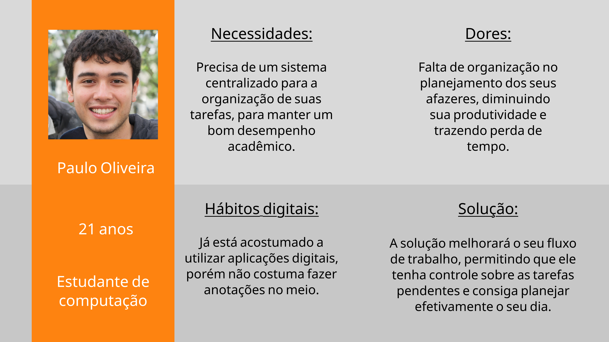

# Web Application Document - Projeto Individual - Módulo 2 - Inteli

## Nome do Projeto

**TaskTrack**

#### Autor do projeto

_Teodoro Borges de Carvalho Neira_

## Sumário

1. [Introdução](#c1)
2. [Visão Geral da Aplicação Web](#c2)
3. [Projeto Técnico da Aplicação Web](#c3)
4. [Desenvolvimento da Aplicação Web](#c4)
5. [Referências](#c5)

 

## 1. Introdução (Semana 01)

O sistema desenvolvido é uma **aplicação web**. O seu principal objetivo é **gerenciar tarefas**, contribuindo para a **organização** e **produtividade** do usuário. Isso é possível por meio da utilização de um **banco de dados**, armazenando as informações inseridas e permitindo a sua consulta. Além disso, o banco tabém permite a **filtração dos dados**, tornando a experiência mais personalizada.

De uma forma geral, a aplicação web é voltada, primordialmente, para **estudantes** de **todas as idades**. Isso se deve ao fato do ambiente acadêmico requerir diversos entregas ao decorrer do curso, tornando a tarefa de gerenciamento algo **complicado** e **demorado**. No entanto, a aplicação também é capaz de suprir as necessidades de um **público em geral**, que necessita organizar os seus afazeres.

---

## 2. Visão Geral da Aplicação Web

### 2.1. Personas (Semana 01)

Figura 1 - Persona 

 

Produção Autoral 

 

---

### 2.2. User Stories (Semana 01)

| Identificação    | US01                                                                                                                                                                                                                                                                                                                                                                                                                                                                                                                                                                                                                                         |
| ---------------- | -------------------------------------------------------------------------------------------------------------------------------------------------------------------------------------------------------------------------------------------------------------------------------------------------------------------------------------------------------------------------------------------------------------------------------------------------------------------------------------------------------------------------------------------------------------------------------------------------------------------------------------------- |
| Persona          | Paulo Oliveira                                                                                                                                                                                                                                                                                                                                                                                                                                                                                                                                                                                                                               |
| User Story       | "como estudante de computação, quero poder registrar todas as minhas tarefas, para organizar meus estudos."                                                                                                                                                                                                                                                                                                                                                                                                                                                                                                                                  |
| Critérios INVEST | A _User Story_ é **independente** pois a função de registrar as tarefas no banco de dados não depende de outras funcionalidades, e ela é capaz de ser testada separadamente. Ela é **negociável** pois a _User Story_ pode ser ajustada e melhorada com o passar do tempo. Agrega **valor**, mitigando as dores da _persona_ e criando benefícios. Também é **estimável**, tendo uma complexidade razoável para o tempo de desenvolvimento do projeto. A _User Story_ é **pequena**, podendo ser concluída em um ciclo de desenvolvimento. Por fim, pode ser **testada**, garantindo que a função de registar as tarefas opera corretamente. |

 

| Identificação | US02                                                                                                              |
| ------------- | ----------------------------------------------------------------------------------------------------------------- |
| Persona       | Paulo Oliveira                                                                                                    |
| User Story    | "como estudante de computação, quero poder definir prazos à tarefas para definir os meus afazeres prioritários. " |

 

| Identificação | US03                                                                                       |
| ------------- | ------------------------------------------------------------------------------------------ |
| Persona       | Paulo Oliveira                                                                             |
| User Story    | "como estudante de computação, quero um ambiente digital intuitivo para não ficar perdido. |

 

---

## 3. Projeto da Aplicação Web

### 3.1. Modelagem do banco de dados (Semana 3)

_Posicione aqui os diagramas de modelos relacionais do seu banco de dados, apresentando todos os esquemas de tabelas e suas relações. Utilize texto para complementar suas explicações, se necessário._

_Posicione também o modelo físico com o Schema do BD (arquivo .sql)_

### 3.1.1 BD e Models (Semana 5)

_Descreva aqui os Models implementados no sistema web_

### 3.2. Arquitetura (Semana 5)

_Posicione aqui o diagrama de arquitetura da sua solução de aplicação web. Atualize sempre que necessário._

**Instruções para criação do diagrama de arquitetura**

- **Model**: A camada que lida com a lógica de negócios e interage com o banco de dados.
- **View**: A camada responsável pela interface de usuário.
- **Controller**: A camada que recebe as requisições, processa as ações e atualiza o modelo e a visualização.

_Adicione as setas e explicações sobre como os dados fluem entre o Model, Controller e View._

### 3.3. Wireframes (Semana 03)

_Posicione aqui as imagens do wireframe construído para sua solução e, opcionalmente, o link para acesso (mantenha o link sempre público para visualização)._

### 3.4. Guia de estilos (Semana 05)

_Descreva aqui orientações gerais para o leitor sobre como utilizar os componentes do guia de estilos de sua solução._

### 3.5. Protótipo de alta fidelidade (Semana 05)

_Posicione aqui algumas imagens demonstrativas de seu protótipo de alta fidelidade e o link para acesso ao protótipo completo (mantenha o link sempre público para visualização)._

### 3.6. WebAPI e endpoints (Semana 05)

_Utilize um link para outra página de documentação contendo a descrição completa de cada endpoint. Ou descreva aqui cada endpoint criado para seu sistema._

### 3.7 Interface e Navegação (Semana 07)

_Descreva e ilustre aqui o desenvolvimento do frontend do sistema web, explicando brevemente o que foi entregue em termos de código e sistema. Utilize prints de tela para ilustrar._

---

## 4. Desenvolvimento da Aplicação Web (Semana 8)

### 4.1 Demonstração do Sistema Web (Semana 8)

_VIDEO: Insira o link do vídeo demonstrativo nesta seção_
_Descreva e ilustre aqui o desenvolvimento do sistema web completo, explicando brevemente o que foi entregue em termos de código e sistema. Utilize prints de tela para ilustrar._

### 4.2 Conclusões e Trabalhos Futuros (Semana 8)

_Indique pontos fortes e pontos a melhorar de maneira geral._
_Relacione também quaisquer outras ideias que você tenha para melhorias futuras._

## 5. Referências

_Incluir as principais referências de seu projeto, para que seu parceiro possa consultar caso ele se interessar em aprofundar. Um exemplo de referência de livro e de site:_ 

---

---
