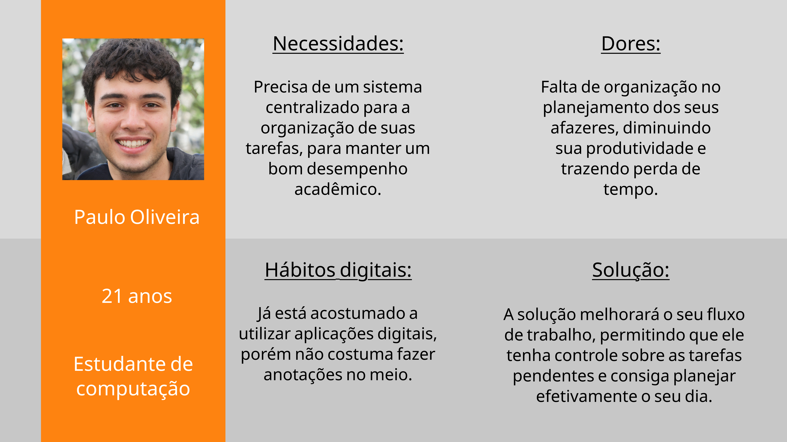
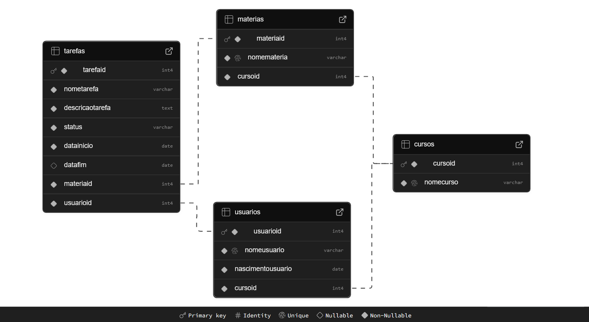
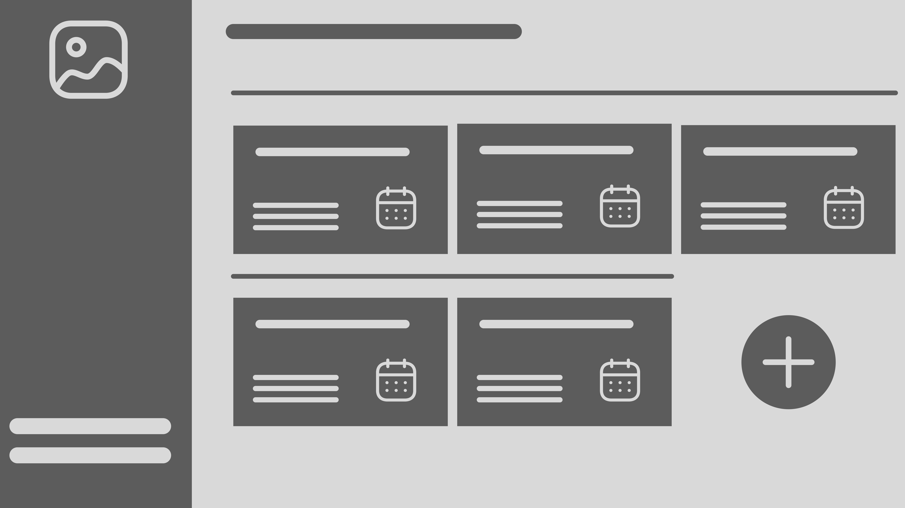

# Web Application Document - Projeto Individual - Módulo 2 - Inteli

## Nome do Projeto

**TaskTrack**

#### Autor do projeto

_Teodoro Borges de Carvalho Neira_

## Sumário

1. [Introdução](#c1)
2. [Visão Geral da Aplicação Web](#c2)
3. [Projeto Técnico da Aplicação Web](#c3)
4. [Desenvolvimento da Aplicação Web](#c4)
5. [Referências](#c5)

<br>

## <a name="c1"></a>1. Introdução (Semana 01)

O sistema desenvolvido é uma **aplicação web**. O seu principal objetivo é **gerenciar tarefas**, contribuindo para a **organização** e **produtividade** do usuário. Isso é possível por meio da utilização de um **banco de dados**, armazenando as informações inseridas e permitindo a sua consulta. Além disso, o banco tabém permite a **filtração dos dados**, tornando a experiência mais personalizada.

De uma forma geral, a aplicação web é voltada para **estudantes** de **todas as idades**. Isso se deve ao fato do ambiente acadêmico requerer diversas entregas ao decorrer do curso, tornando a tarefa de gerenciamento algo **complicado** e **demorado**. Para isso, a aplicação é capaz de **registrar as tarefas**, contendo **título, descrição, data de início e fim**, além da **matéria referente**. Essa forma de entrada de dados **simplifica a visualização** dos afazeres, permitindo que o estudante se **organize** e tenha mais tempo para **dedicar-se ao estudos**.

---

## <a name="c2"></a>2. Visão Geral da Aplicação Web

### 2.1. Personas (Semana 01)

<div align="center">
<sub>Figura 1 - Persona </sub>
<div align="center">
</div>
<br>

<sub>Produção Autoral </sub>
<div align="center">
<br>
</div>

---

### 2.2. User Stories (Semana 01)

| Identificação    | US01                                                                                                                                                                                                                                                                                                                                                                                                                                                                                                                                                                                                                                         |
| ---------------- | -------------------------------------------------------------------------------------------------------------------------------------------------------------------------------------------------------------------------------------------------------------------------------------------------------------------------------------------------------------------------------------------------------------------------------------------------------------------------------------------------------------------------------------------------------------------------------------------------------------------------------------------- |
| Persona          | Paulo Oliveira                                                                                                                                                                                                                                                                                                                                                                                                                                                                                                                                                                                                                               |
| User Story       | "como estudante de computação, quero poder registrar todas as minhas tarefas, para organizar meus estudos."                                                                                                                                                                                                                                                                                                                                                                                                                                                                                                                                  |
| Critérios INVEST | A _User Story_ é **independente** pois a função de registrar as tarefas no banco de dados não depende de outras funcionalidades, e ela é capaz de ser testada separadamente. Ela é **negociável** pois a _User Story_ pode ser ajustada e melhorada com o passar do tempo. Agrega **valor**, mitigando as dores da _persona_ e criando benefícios. Também é **estimável**, tendo uma complexidade razoável para o tempo de desenvolvimento do projeto. A _User Story_ é **pequena**, podendo ser concluída em um ciclo de desenvolvimento. Por fim, pode ser **testada**, garantindo que a função de registar as tarefas opera corretamente. |

<br>

| Identificação | US02                                                                                                              |
| ------------- | ----------------------------------------------------------------------------------------------------------------- |
| Persona       | Paulo Oliveira                                                                                                    |
| User Story    | "como estudante de computação, quero poder definir prazos à tarefas para definir os meus afazeres prioritários. " |

<br>

| Identificação | US03                                                                                       |
| ------------- | ------------------------------------------------------------------------------------------ |
| Persona       | Paulo Oliveira                                                                             |
| User Story    | "como estudante de computação, quero um ambiente digital intuitivo para não ficar perdido. |

<br>

---

## <a name="c3"></a>3. Projeto da Aplicação Web

### 3.1. Modelagem do banco de dados (Semana 3)

#### Modelo Relacional

O diagrama relacional do banco de dados permite uma visualização concisa das estrutura de armazenamento de dados utilizadas. Para esse projeto, o modelo pode ser visto à seguir:

<div align="center">
<sub>Figura 2 - Modelo relacional do banco de dados </sub>
<div align="center">
</div>
<br>

<sub>Produção Autoral </sub>
<div align="center">
<br>
</div>

Para o projeto escolhido, 4 tabelas foram criadas. A primeira delas é dos **cursos** existentes. É por meio do cursos que as **matérias** são definidas. Cada matéria está relacionada diretamente com um curso, permitindo que a aplicação consiga fornecer a lista de possíveis matérias de um aluno quando ele informar o seu curso. No entanto, uma mesma matéria pode aparecer em cursos diferentes. Esse problema é resolvido por meio das _Primary Keys_, que serão explicadas adiante. Depois, a tabela **usuários** tem a função de cadastrar aquele que está na plataforma, relacionando-o com o seu curso escolhido, além de outras informações básicas. Por fim, temos a tabela **tarefas**. Ela atua como a união entre os usuários e as matérias. Ou seja, cada tarefa registrada se refere à um usuário e matéria, além de conter outras informações essenciais, como status da atividade e data de finalização.

As linhas registradas com uma chave representam _Primary Keys_. Ela identifica unicamente cada item da tabela, evitando repetições e possíveis problemas. O símbolo de impressão digital simboliza que a coluna não aceitará dados iguais. Por exemplo, não poderão dois nomes de usuário idênticos, evitando conflitos. Por fim, os losangos preenchidos e não preenchidos apresentam se o campo pode ou não pode receber nenhuma entrada.

As linhas presentes no diagrama simbolizam as relações entre as tabelas. Elas ocorrem por meio das _Foreign Keys_, que trazem linhas de outras tabelas para a tabela desejada, criando uma relação de dependência.

#### Modelo Físico

O modelo físico do banco de dados pode ser visto adiante. Ele também está presente [aqui](/scripts/init.sql)

```sql
CREATE TABLE cursos (
  cursoId SERIAL PRIMARY KEY,
  nomeCurso VARCHAR(255) NOT NULL UNIQUE
);

CREATE TABLE usuarios (
  usuarioId SERIAL PRIMARY KEY,
  nomeUsuario VARCHAR(255) NOT NULL UNIQUE,
  nascimentoUsuario DATE NOT NULL,
  cursoId INT NOT NULL,
  FOREIGN KEY (cursoId) REFERENCES cursos(cursoId)
);

CREATE TABLE materias (
  materiaId SERIAL PRIMARY KEY,
  nomeMateria VARCHAR(255) NOT NULL UNIQUE,
  cursoId INT NOT NULL,
  FOREIGN KEY (cursoId) REFERENCES cursos(cursoId)
);

CREATE TABLE tarefas (
  tarefaId SERIAL PRIMARY KEY,
  nomeTarefa VARCHAR(255) NOT NULL,
  descricaoTarefa TEXT NOT NULL,
  status VARCHAR(255) NOT NULL,
  dataInicio DATE NOT NULL,
  dataFim DATE,
  materiaId INT NOT NULL,
  usuarioId INT NOT NULL,
  FOREIGN KEY (materiaId) REFERENCES materias(materiaId),
  FOREIGN KEY (usuarioId) REFERENCES usuarios(usuarioId)
);
```

### 3.1.1 BD e Models (Semana 5)

Os models são a parte da aplicação web que possibilita a execução de consultas no banco de dados. Elas seguem os conceitos do CRUD (_Create, Read, Update e Delete_) para essas consultas. Dessa forma, somos capazes de consultar, adicionar, alterar e deletar dados do banco de dados.

No caso desse sistema web, estão presentes 5 models. O primeiro deles é o dos cursos, que trata do cadastro e consuta dos cursos utilizados para a organização das tarefas da aplicação. O segundo é o das materias, que atua como uma subdivisão dos cursos, garantindo uma maior especifidade. A terceira é os usuários. Esse model é o responsável por criar, alterar e deletar novos usuários para o sistema, garantindo que as tarefas condizam com quem está utilizando a aplicação. Depois, temos o model das tarefas. Ele é a parte mais essencial, já que é por meio dele que conseguimos colocar as atividades que necessitam ser realizadas, o conceito essencial da solução. Por fim, temos o model do login, que serve para a autentificação dos usuários, com email e senha.

### 3.2. Arquitetura (Semana 5)

<div align="center">
<sub>Figura 3 - Arquitetura da aplicação web </sub>
<div align="center">
</div>
<br>

<sub>Produção Autoral </sub>
<div align="center">
<br>
</div>

A aplicação web utiliza-se da estrutura MVC para organização. Ela é dividida em 3 seções: **Model**, **View** e **Controller**. O Model é responsável pela comunicação e consultas com o banco de dados, tratando da atualização e inserção de informações. O Controller representa o backend da aplicação. Ele que realiza a ponte entre a interface e a comunicação com o banco de dados. Por fim, o View trata daquilo que o usuário interage, indicando o aspecto visual (frontend).


### 3.3. Wireframes (Semana 03)

**_Wireframes_**   contribuem para o planejamento da **interface do usuário**, reduzindo a necessidade de alterar protótipos constantemente durante o refinamento da experiência. Os _wireframes_ relacionados à esse projeto podem ser vistos à seguir:

<div align="center">
<sub>Figura X - Wireframe (Dashboard) </sub>
<div align="center">
</div>
<br>

<sub>Produção Autoral </sub>
<div align="center">
<br>
</div>

<div align="center">
<sub>Figura X - Wireframe (Criar Tarefa) </sub>
<div align="center">
</div>
<br>

<sub>Produção Autoral </sub>
<div align="center">
<br>
</div>

Ambos os **_wireframes_** buscam representar as **_user stories_** definidas. A primeira tela apresenta a **_dashboard_** do usuário, apresentando as **tarefas** e seus **prazos**, além de fornecer um botão para o **registro** de outras atividades. Ela está diretamente relacionada com a **US03**, trazendo um ambiente **simplificado** e **intuitivo** para o utilizador, facilitando a utilização da aplicação. Já a segunda tela demonstra a **criação de uma nova tarefa**, dialogando com a **US01**, que aborda o **registro das atividades**. O _wireframe_ demonstra o processo de registro, com campos para a inserção de **nome, descrição, matéria, status e agendamento** das tarefas.


### 3.4. Guia de estilos (Semana 05)

_Descreva aqui orientações gerais para o leitor sobre como utilizar os componentes do guia de estilos de sua solução._

### 3.5. Protótipo de alta fidelidade (Semana 05)

_Posicione aqui algumas imagens demonstrativas de seu protótipo de alta fidelidade e o link para acesso ao protótipo completo (mantenha o link sempre público para visualização)._

### 3.6. WebAPI e endpoints (Semana 05)

Os endpoints do projeto podem ser testados por meio do _Postman_, ou outra ferramenta similar.

#### **localhost:3000/api/login**

**POST**

**Exemplo de entrada JSON:**
```json
{
  "email": "teste@teste.com.br",
  "senha": "123123"
}
```

---

#### **localhost:3000/api/cursos**

**GET**  
 Retorna todos os cursos cadastrados.

**POST**  

 **Exemplo de entrada JSON:**
  ```json
  {
    "cursoid": "2",
    "nomecurso": "Engenharia de Software"
  }
  ```

---

#### **localhost:3000/api/cursos/:id**

**PUT**  

**Exemplo de entrada JSON:**
```json
{
  "cursoid": "1",
  "nomecurso": "Novo Nome do Curso"
}
```

**DELETE**  

 **Exemplo de entrada JSON:**
  ```json
{
  "cursoid": "1"
}
  ```

---

#### **localhost:3000/api/usuarios**

**GET**  
 Retorna todos os usuários cadastrados (sem o campo senha).

**POST**  

 **Exemplo de entrada JSON:**
  ```json
  {
    "usuarioid": 2,
    "nomeusuario": "Usuário de Teste 2",
    "nascimentousuario": "2000-01-01",
    "cursoid": 1,
    "senha": "123123",
    "email": "teste2@teste.com.br"
  }
  ```

---

#### **localhost:3000/api/usuarios/:id**

**PUT**  

**Exemplo de entrada JSON:**
```json
{
  "usuarioid": 2,
    "nomeusuario": "Usuário de Teste 2",
    "nascimentousuario": "2000-01-01",
    "cursoid": 1,
    "senha": "123123",
    "email": "teste2@teste.com.br"
}
```

**DELETE**  

 **Exemplo de entrada JSON:**
  ```json
{
  "usuarioid": "1"
}
  ```
---

#### **localhost:3000/api/materias**

 **GET**  
 Retorna todas as matérias cadastradas.


**POST**  

 **Exemplo de entrada JSON:**
  ```json
{
"materiaid": "2",
"nomemateria": "Matemática",
"cursoid": "2"
}
  ```

---

#### **localhost:3000/api/materias/:id**

**PUT**  

**Exemplo de entrada JSON:**
```json
{
  "materiaid": "2",
  "nomemateria": "Matemática",
  "cursoid": "2"
}
```

**DELETE**  

 **Exemplo de entrada JSON:**
  ```json
{
  "materiaid": "1"
}
  ```
---

#### **localhost:3000/api/tarefas**

 **GET**  
 Retorna todas as tarefas cadastradas.


**POST**  

 **Exemplo de entrada JSON:**
  ```json
  {
    "tarefaid": 1,
    "nometarefa": "Estudar para prova",
    "descricaotarefa": "Revisar capítulos 1 a 3",
    "status": "pendente",
    "datainicio": "2024-06-01",
    "datafim": "2024-06-10",
    "materiaid": 1,
    "usuarioid": 2
  }
  ```

---

#### **localhost:3000/api/tarefas/:id**

**PUT**  

**Exemplo de entrada JSON:**
```json
{
  "tarefaid": 1,
  "nometarefa": "Estudar para prova",
  "descricaotarefa": "Revisar capítulos 1 a 3",
  "status": "pendente",
  "datainicio": "2024-06-01",
  "datafim": "2024-06-10",
  "materiaid": 1,
  "usuarioid": 2
}
```

**DELETE**  

 **Exemplo de entrada JSON:**
  ```json
{
  "tarefaid": "1"
}
  ```
---


### 3.7 Interface e Navegação (Semana 07)

_Descreva e ilustre aqui o desenvolvimento do frontend do sistema web, explicando brevemente o que foi entregue em termos de código e sistema. Utilize prints de tela para ilustrar._

---

## <a name="c4"></a>4. Desenvolvimento da Aplicação Web (Semana 8)

### 4.1 Demonstração do Sistema Web (Semana 8)

_VIDEO: Insira o link do vídeo demonstrativo nesta seção_
_Descreva e ilustre aqui o desenvolvimento do sistema web completo, explicando brevemente o que foi entregue em termos de código e sistema. Utilize prints de tela para ilustrar._

### 4.2 Conclusões e Trabalhos Futuros (Semana 8)

_Indique pontos fortes e pontos a melhorar de maneira geral._
_Relacione também quaisquer outras ideias que você tenha para melhorias futuras._

## <a name="c5"></a>5. Referências

_Incluir as principais referências de seu projeto, para que seu parceiro possa consultar caso ele se interessar em aprofundar. Um exemplo de referência de livro e de site:_<br>

---
